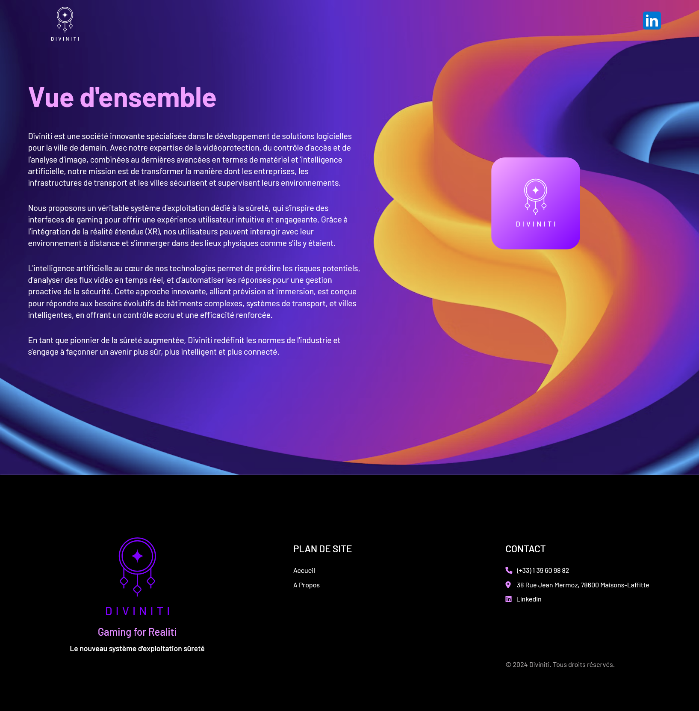

# Diviniti Website

## Description

**Diviniti** est une société innovante qui développe des solutions logicielles pour la ville de demain. Nous sommes à la pointe de la vidéoprotection, du contrôle d'accès et de l'analyse d'image, avec un accent particulier sur l'intelligence artificielle. Ce projet représente le début d'une landing page dédiée à nos offres, accessible via [www.diviniti.fr](http://www.diviniti.fr), [www.diviniti.tech](http://www.diviniti.tech) et [www.diviniti.io](http://www.diviniti.io).

Nous offrons un système d'exploitation dédié à la sûreté, inspiré des interfaces de gaming, pour une expérience utilisateur intuitive. Grâce à la réalité étendue (XR) et à notre technologie d'IA, nous permettons une gestion proactive de la sécurité dans les environnements urbains.

## Table des matières

- [Caractéristiques](#caractéristiques)
- [Technologies utilisées](#technologies-utilisées)
- [Screenshots](#screenshots)

## Caractéristiques

- Solutions logicielles avancées pour la sécurité urbaine.
- Expérience utilisateur inspirée des interfaces de gaming.
- Intégration de la réalité étendue (XR) pour une immersion totale.
- Intelligence artificielle pour l'analyse en temps réel et la prédiction des risques.
- Système d'exploitation dédié à la sûreté, offrant un contrôle accru des environnements complexes.

## Technologies utilisées

- **Next.js** pour le développement de l'application web.
- **Sass (SCSS)** pour le style et la mise en page.
- **Framer Motion** pour les animations et transitions.
- **Next.js Google Analytics** pour le suivi des utilisateurs.
- **React** et **React DOM** pour la construction de l'interface utilisateur.

## Screenshots

